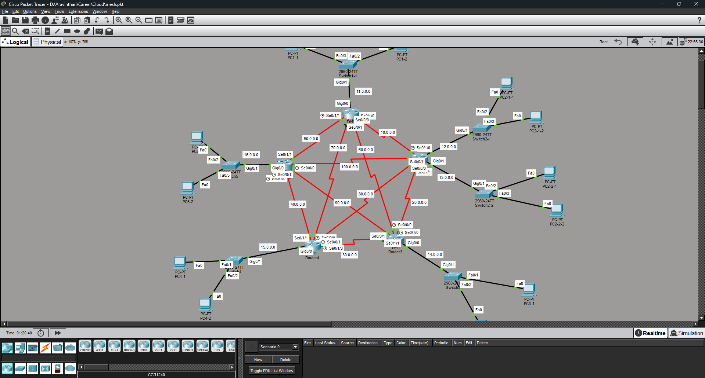

# CCNA Lab: Static Routing on a 6-Router Mesh Topology

A hands-on Cisco Packet Tracer lab where I built a 6-router **full mesh network**
and connected every LAN together using **static routing**.



## What this lab covers

- Building a full mesh topology (6 routers, each connected to every other router)
- Assigning unique IP networks to every LAN and every serial (router-to-router) link
- Configuring router interfaces (GigabitEthernet + Serial)
- Configuring PCs with IP address, subnet mask, and default gateway
- Writing static routes so routers know how to reach remote networks
- Verifying connectivity end-to-end with `ping` and route/interface checks
- Watching packets travel hop-by-hop using Simulation Mode

## Topology summary

- 6 routers, fully meshed via serial links (each router connects directly to
  every other router)
- Each router connects to a switch, which connects to 1–2 PCs (the LAN side)
- Every link — LAN or serial — uses its own unique network address
  (see [addressing-table.md](addressing-table.md))

## Files in this repo

| File | Purpose |
|---|---|
| `topology-diagram.png` | Screenshot of the full Packet Tracer topology |
| `addressing-table.md` | Every network used, and which interface it belongs to |
| `configs/router1-sample-config.txt` | Full example of how one router was configured |
| `static-routes.md` | All static routes used, with the logic explained |
| `notes.md` | Concepts learned + commands used to verify everything |

## Key takeaway

With static routing, **you don't need a route for directly connected networks** —
only for networks that are one or more hops away. Each `ip route` command tells
a router: *"to reach this destination network, send the packet to this
neighbor's IP address (next hop)."*

```text
ip route <destination network> <subnet mask> <next-hop IP>
```

## Result

✅ Full mesh of 6 routers built and configured
✅ All PCs across all LANs can ping each other
✅ Verified using `show ip route`, `show ip interface brief`, and `ping`
